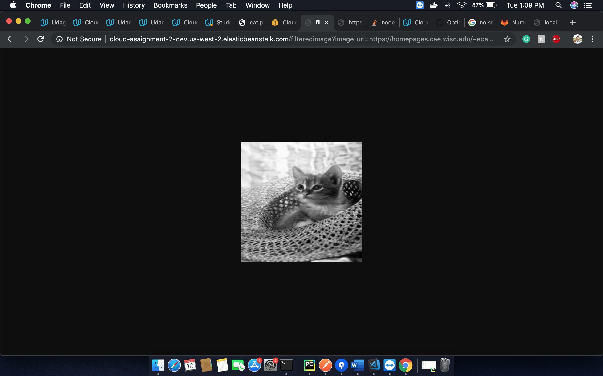

# Udagram Image Filtering Microservice (Pet Project)

### Setup Node Environment

You'll need to create a new node server. Open a new terminal within the project directory and run:

1. Initialize a new project: `npm i`
2. run the development server with `npm run dev`

###AWS APPLICATION

This is a web app hosted in AWS, a mini image filtering system. It filters any public image added in the endpoint, processes it and then shows the filtered image. It cleans the storage so that it does not take additional space during this process. 

